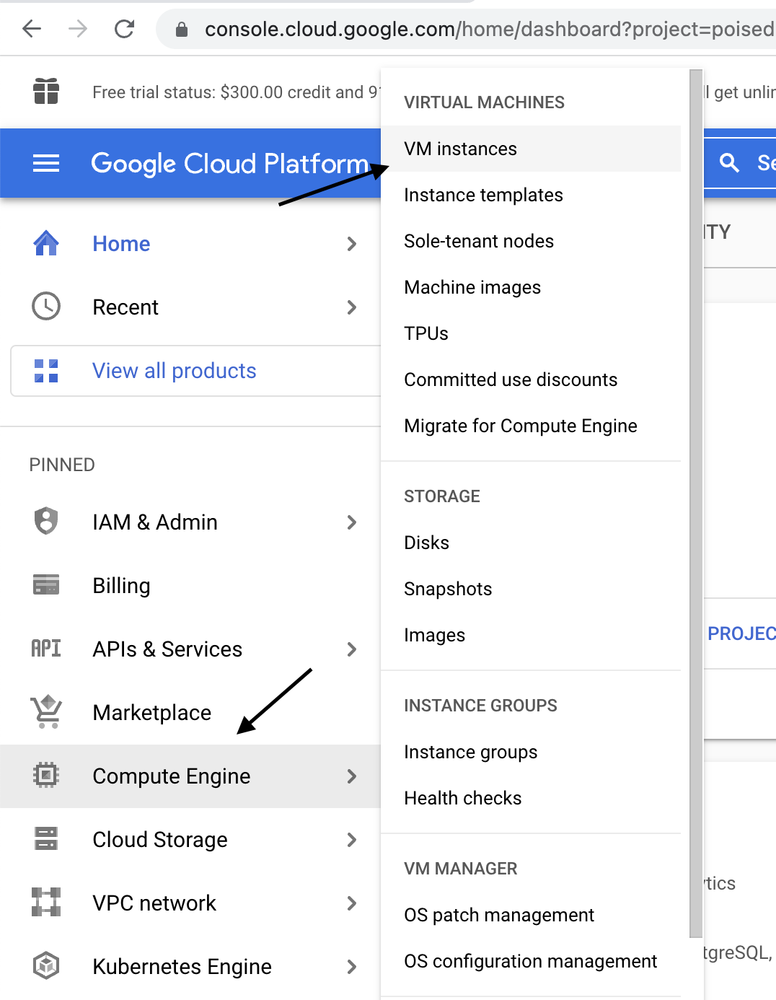
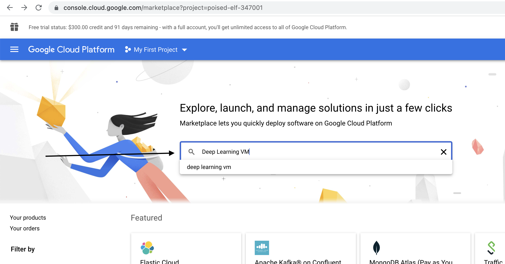
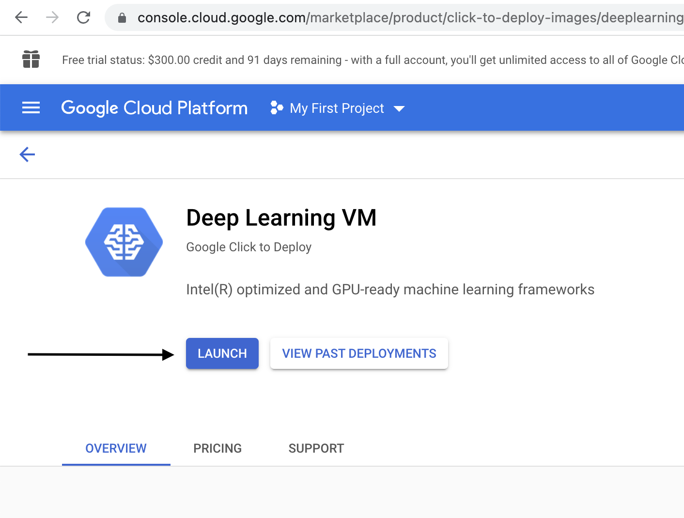
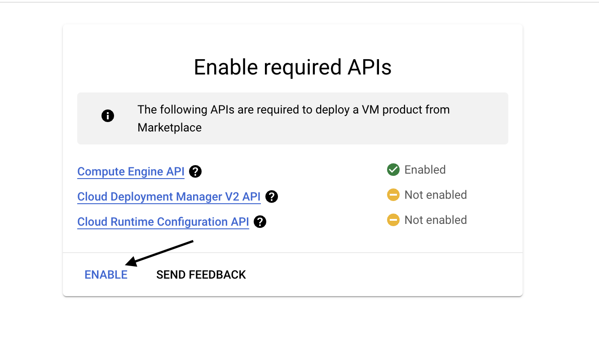
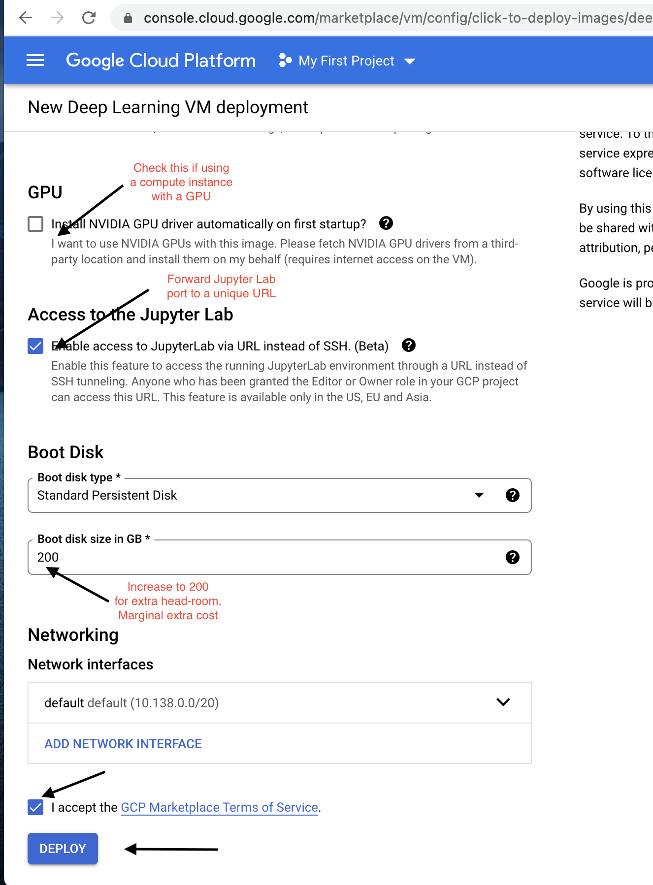
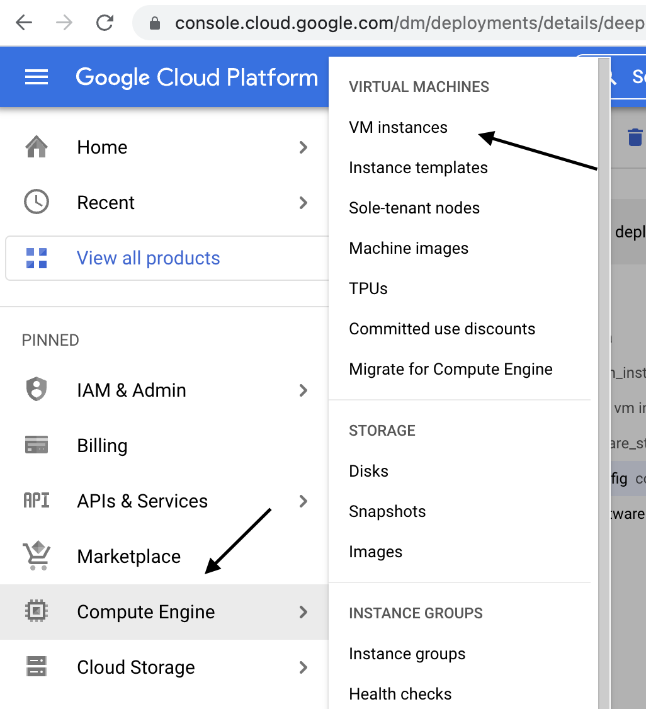

# Developing Project 3 on Google Cloud Platform

This is a reference for setting up project 3 on a google cloud compute instance. **Please be warned**: this does cost actual real money and GT is not responsible for paying your bill, nor is GT able to provide compute credits. GCP does however provide a sign-up offer of $300 at the time of writing this (April 2022), and additional credits are offered for providing more email addresses on the account. This project will likely cost between $200 and $400 for single GPU (Nvidia Tesla K80) instances, and considerable less for CPU optimized instances.

## How to Setup

### Sign-up

Visit <https://cloud.google.com/free>


### Create an account

**THIS WILL REQUIRE A CREDIT CARD AND ADDRESS**


Awesome, now your account is created!

### Enable Google Compute Engine for your profile




### Finding the right VM

Now let's find the "Deep Learning VM" that Google created to make our lives easy.






There are a few other odds and ends that Google Cloud Platform requires you to enable in order to provision these VMs.



### Provisioning the VM

Almost there, now we need to provision the VM. This is a bit of a fork in the road: do you want to go with a GPU instance that can improve training time at greater cost or stick with the CPU only instances that take a bit longer but cost less money? `¯\_(ツ)_/¯`




Boom, now you have a machine running in GCP!!! Let's configure how to access that now!

### Accessing your machine

1) on your local environment install `gcloud-cli`. Instillation instructions for all platfoms can be found [here](https://cloud.google.com/sdk/docs/install)

1.1) Make sure to run `gcloud init` to authenticate with your gcloud account.

2) Let's SSH into your instance!




3) Paste that command into your local terminal

should look something like:

```bash
gcloud compute ssh --zone "{your-zone}" "deeplearning-1-vm"  --project "{your-project-name}"
```

Now you should be on your VM! Poke around, have some fun.

4) Find the URL for the python notebook:

```bash
gcloud compute instances describe --zone "{your-zone}" "deeplearning-1-vm"  --project "{your-project-name}" | grep googleusercontent.com
```

This will output a URL that you can visit in your web browser.

#### Caveats

If you're on a free tier account you may not have access to GPU instances, in that case it is recommended that you use a compute 4 core vCPU. If you want GPU instances (cause they're really cool), just complete registration for a full account, that should give you a 1 GPU allocation. If you want more you're going to have to make an allocation request in your billing section.

### Getting P3 Docker Running

This is going to be slightly different from the instructions to get docker running locally because we are not going to want a second jupyter lab server running, and we need escalated permissions in this remote environment to install `rldm` as a package.

1) SSH back into the instance as shown above
2) Copy the codebase onto your machine: `git clone https://github.gatech.edu/rldm/p3_docker.git && cd p3_docker`
3) `docker pull mimoralea/rldm:latest`
4) Go make some tea, this is going to take a minute
5) Spin up a container:

- With GPUs:
  - ```docker run -it --rm --gpus all -p 8888:8888 -p 6006:6006 -p 8265:8265 -v "$PWD":/mnt mimoralea/rldm:latest```
- Without GPUs:
  - ```docker run -it --rm -p 8888:8888 -p 6006:6006 -p 8265:8265 -v "$PWD":/mnt mimoralea/rldm:latest```

This will install most of the requirements, but should fail to install the `rldm` package... that's expected!

Next, quit the jupyter notebook `ctrl + c`

6) Login with root creds

- With GPUs:
  - ```docker run -it --user root --entrypoint /bin/bash --rm --gpus all -p 8888:8888 -p 6006:6006 -p 8265:8265 -v "$PWD":/mnt mimoralea/rldm:latest```
- Without GPUs:
  - ```docker run -it --user root --entrypoint /bin/bash --rm -p 8888:8888 -p 6006:6006 -p 8265:8265 -v "$PWD":/mnt mimoralea/rldm:latest```

Install the `rldm` package: `pip install -e /mnt`

7) Test that you can run training

`python -m rldm.scripts.run_random`

Awesome! You can train now!!Leave that docker instance running for the duration of your time using the instance.

### Transferring files to and from the compute instance

For this we're going to enlist the help of `scp` run from your local machine.

For  transferring from local to remote:

```bash
gcloud compute scp --project {your-project-name} --zone {your-zone} --recurse {local file or directory} deeplearning-1-vm:{remote file or directory}
```

For transferring from remote to local:

```bash
gcloud compute scp --project {your-project-name} --zone {your-zone} --recurse deeplearning-1-vm:{remote file or directory} {local file or directory}
```

#### Caveats

At the end of training your logs are going to have a whole bunch of files, SCP can fail to download if there are too many files. Fear not, tar is coming to our rescue, just run the following:

1) Compress files into a single tar file: `tar -czvf logs.tar.gz /mnt/p3_docker/logs/`
2) download that `logs.tar.gz` file using SCP like above
3) Decompress tar file into many files: `tar -xzvf logs.tar.gz .`
4) Boom, now you got your files!

### After you're done

**DON'T FORGET TO TURN OFF YOUR INSTANCES - YOU ARE BEING CHARGED FOR EACH MINUTE THEY ARE RUNNING**


### Other considerations

You can follow the above steps to start multiple instances in the same manner, this will help by allowing you to train several models in parallel reducing the wall clock time required for your project overall!
